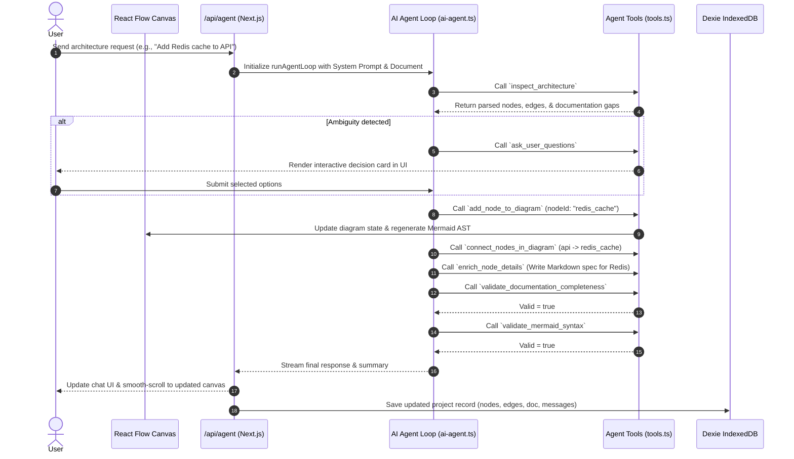

# ArchiText — AI System Architecture Canvas & Blueprint Engine


**ArchiText** is an interactive, AI-driven visual architecture design, diagramming, and documentation platform. It bridges the gap between **high-level visual system diagrams** and **implementation-ready technical documentation** by combining a two-way reactive Mermaid canvas, an autonomous AI architect agent, a local offline-first database, and an automated project blueprint exporter.

---

## Table of Contents

- [The Core Problems ArchiText Solves](#-the-core-problems-architext-solves)
- [How It Solves Them (Key Innovations)](#-how-it-solves-them-key-innovations)
- [How Codex Helped Build ArchiText](#-how-codex-helped-build-architext)
- [Technology Stack & Key Libraries](#-technology-stack--key-libraries)
- [System Architecture & Data Flow](#-system-architecture--data-flow)
- [Deep Dive: Core Modules](#-deep-dive-core-modules)
  - [1. Two-Way Reactive Canvas Engine](#1-two-way-reactive-canvas-engine)
  - [2. Autonomous AI Agent & Tool Calling Loop](#2-autonomous-ai-agent--tool-calling-loop)
  - [3. DeepSeek & Vercel AI SDK Interceptor](#3-deepseek--vercel-ai-sdk-interceptor)
  - [4. Dual Hierarchical Layout Kernel (ELK.js + Dagre)](#4-dual-hierarchical-layout-kernel-elkjs--dagre)
  - [5. Component Metadata & Markdown Blueprint Exporter](#5-component-metadata--markdown-blueprint-exporter)
  - [6. Offline-First IndexedDB Storage Layer](#6-offline-first-indexeddb-storage-layer)
- [Engineering Challenges & Technical Solutions](#-engineering-challenges--technical-solutions)
- [Project Directory Structure](#-project-directory-structure)
- [Getting Started & Installation](#-getting-started--installation)
- [Environment Variables](#-environment-variables)
- [API Reference](#-api-reference)

---

## The Core Problems ArchiText Solves

### 1. Disconnection Between Visual Diagrams and Technical Docs
* **The Problem:** Standard architecture tools (Lucidchart, Draw.io, Visio) generate static graphics that lack detailed technical specifications, API contracts, persistence models, and implementation guidelines. Conversely, text-based architecture docs quickly drift out of sync with visual topology.
* **The Solution:** ArchiText treats Markdown text and visual Mermaid topology as **co-equal source of truth**. Every visual node on the canvas maps 1-to-1 to a structured Markdown specification block (`### Component: <node-id>`), ensuring visual diagrams and technical documentation never drift apart.

### 2. Manual Diagramming Complexity & Maintenance Overhead
* **The Problem:** Hand-editing raw Mermaid syntax or manually aligning canvas nodes in complex microservice architectures is tedious and error-prone.
* **The Solution:** ArchiText provides a dual-interface model: drag, drop, connect, edit, and group directly on an interactive canvas, or describe your system requirements to an AI Architect Agent that handles node placement, subgraph boundaries, directional edge routing, and documentation enrichment automatically.

### 3. Ambiguous AI Architecture Generation
* **The Problem:** Generic AI assistants make unverified assumptions about tech stacks, databases, authentication providers, or scale requirements when asked to design systems.
* **The Solution:** ArchiText incorporates an **Interactive Clarifying Question System**. If a user's request has ambiguous architectural choices, the AI Agent pauses document mutations and presents structured multi-choice decision cards directly in the UI.

### 4. Cloud Data Privacy & Platform Lock-In
* **The Problem:** Engineers are hesitant to store proprietary system blueprints and internal architecture specifications on centralized third-party servers.
* **The Solution:** ArchiText operates **100% offline-first inside the client browser**. All project states, node positions, viewports, documentation, and chat histories are persisted in browser IndexedDB via Dexie.js.

---

## How It Solves Them (Key Innovations)

```
┌──────────────────────────────────────────────────────────────────────────────────┐
│                             ArchiText Client Application                         │
│                                                                                  │
│   ┌─────────────────────┐    2-Way Sync    ┌─────────────────────────────────┐   │
│   │ React Flow Canvas   │ ◄──────────────► │ Mermaid Markdown Parser & AST   │   │
│   └──────────┬──────────┘                  └────────────────┬────────────────┘   │
│              │                                              │                    │
│              │ Interactive Edits / Drag-and-Drop            │ Automatic Sync     │
│              ▼                                              ▼                    │
│   ┌─────────────────────┐                  ┌─────────────────────────────────┐   │
│   │ ELK.js Layout Engine│                  │ IndexedDB / Dexie Storage Layer │   │
│   └─────────────────────┘                  └────────────────┬────────────────┘   │
│                                                             │                    │
└─────────────────────────────────────────────────────────────┼────────────────────┘
                                                              │ Tool Calling Loop
                                                              ▼
                                            ┌───────────────────────────────────┐
                                            │ DeepSeek / Vercel AI SDK Agent    │
                                            └───────────────────────────────────┘
```

---

# How AI Intelligence (GPT-5.6 & Codex) Built ArchiText

**GPT-5.6** and **Codex** served as co-pilots throughout the entire lifecycle of ArchiText—bridging high-level product reasoning with complex, production-grade system implementation.

While **GPT-5.6** provided deep architectural intelligence, technical strategy, product reasoning, and trade-off evaluation, **Codex** acted as the primary AI pair programmer—designing clean codebase structures, implementing bi-directional AST parsers, writing real-time synchronization engines, and resolving low-level engineering bugs.

---

### Strategic Role Division: GPT-5.6 vs. Codex

| Capability Domain | **GPT-5.6** (Strategic Architecture & Reasoning Advisor) | **Codex** (AI Pair Programmer & Implementation Engine) |
| :--- | :--- | :--- |
| **Product Vision & Architecture** | Designed the high-level system topology, specified the 16-step agent execution loop, and formulated the interactive clarifying question strategy. | Implemented the Next.js 16 App Router structure, React Flow canvas wrapper, and Dexie.js database schemas. |
| **State & AST Synchronization** | Modeled the co-equal state synchronization pattern between Mermaid text blocks and visual React Flow graphs. | Built the custom bracket-counting AST parser (`lib/mermaid.ts`) that handles multi-line labels, subgraphs, and database shapes without syntax loss. |
| **Graph Layout Engineering** | Evaluated graph layout algorithms and recommended ELK.js layered layout over naive grid positioning. | Integrated `elkjs` (`lib/layout.ts`), coding dynamic height math (`getVisualNodeSize`) based on tech stack badge wraps and text lengths. |
| **Persistence & Export Pipeline** | Formulated the offline-first privacy model and specified the multi-file project `.zip` blueprint archive hierarchy. | Wrote `sanitizeNodes()` in `lib/db.ts` to strip un-serializable DOM functions from IndexedDB, and built `JSZip` export routines in `lib/markdownExport.ts`. |
| **Debugging & Problem Solving** | Reasoned through complex edge-case trade-offs, provider tool schema errors, and performance bottlenecks. | Executed step-by-step code refactoring, fixed JSON schema parameter issues in `lib/ai-provider.ts`, and optimized re-renders. |

---

### Deep-Dive Technical Contributions

#### 1. Two-Way Document & Visual Canvas Synchronization
- **Stateful AST Parser Design:** Codex and GPT-5.6 designed the custom stateful Mermaid parser (`parseMermaid` in `lib/mermaid.ts`). GPT-5.6 conceptualized the bracket-counting accumulator algorithm to handle edge cases like multi-line node labels, database cylinder shapes `[()]`, directional edge protocols, and subgraph extractions.
- **Bi-Directional State Sync:** Codex implemented reactive state hooks linking visual drag-and-drop canvas events directly to live Markdown text updates without losing component metadata (`### Component: <node-id>`).

#### 2. Autonomous Agentic Workflow & Tool Orchestration
- **16-Step Autonomous Execution Loop:** Designed and engineered the multi-step agent loop (`runAgentLoop` in `lib/agent/ai-agent.ts`) using the Vercel AI SDK. Defined strict parameter schemas for tools including `inspect_architecture`, `add_node_to_diagram`, `connect_nodes_in_diagram`, `enrich_node_details`, and `validate_mermaid_syntax`.
- **Interactive Clarifying Questions Engine:** Formulated the `ask_user_questions` state machine and UI component (`ClarifyingQuestionsBox.tsx`), enabling the AI Agent to pause execution and present interactive decision cards to users when architectural ambiguities arise.
- **API Parameter Interceptor:** Built the custom fetch interceptor in `lib/ai-provider.ts` to sanitize JSON tool schemas (`$schema` & `additionalProperties`) for seamless LLM provider tool execution.

#### 3. Advanced Dynamic Graph Layout Kernel
- **ELK.js Integration:** Codex integrated the Eclipse Layout Kernel (`elkjs`) into `lib/layout.ts`, crafting dynamic height calculation algorithms (`getVisualNodeSize`) that scale based on character lengths and tech stack badge rows.
- **Nested Subgraph Coordinate Math:** Solved complex spatial offset calculations for nested child nodes inside group nodes across Left-to-Right (`LR`) and Top-to-Bottom (`TD`) view directions.

#### 4. Offline-First Storage Guards & Zip Exporter
- **IndexedDB Serialization Guard:** Solved browser storage clone errors by writing `sanitizeNodes()` in `lib/db.ts` to scrub non-serializable DOM event listeners from React Flow objects before committing to Dexie.js.
- **Multi-File Blueprint Exporter:** Engineered `markdownExport.ts` and `ExportModal.tsx`, leveraging `JSZip` to bundle complete system blueprints into downloadable `.zip` project archives structured by subgraph folder hierarchies.

---

### Summary
Together, **GPT-5.6** served as an intelligent design advisor and system architect, while **Codex** acted as a tireless AI pair programmer—allowing ArchiText to be built faster, cleaner, and with a significantly more resilient architecture.

---

## Technology Stack & Key Libraries

| Technology / Library | Version | Purpose & Strategic Rationale |
| :--- | :--- | :--- |
| **Next.js** | `16.2.10` | App Router foundation, server routes, streaming APIs, and server-side optimizations. |
| **React** | `19.2.4` | Component framework leveraging latest hooks, transition features, and concurrent rendering. |
| **TypeScript** | `^5.0` | End-to-end type safety across graph topologies, database entities, and tool payloads. |
| **@xyflow/react** (React Flow) | `^12.11.2` | High-performance interactive diagram canvas, pan/zoom viewports, custom nodes, handles & edge routing. |
| **elkjs** (Eclipse Layout Kernel) | `^0.12.0` | Advanced automated graph layout engine capable of layered subgraph/group nested layouts. |
| **dagre** | `^0.8.5` | Lightweight alternative directed-graph layout calculator for fast fallback rendering. |
| **Vercel AI SDK** (`ai`) | `^7.0.31` | Unified stream management, tool calling orchestration (`generateText`, `streamText`), and agent execution loops. |
| **@ai-sdk/openai** | `^4.0.16` | OpenAI-compatible provider adapter used to connect to DeepSeek API models. |
| **Dexie.js** | `^4.4.4` | Minimalist IndexedDB wrapper with reactive hooks (`dexie-react-hooks`) for client-side persistence. |
| **Tailwind CSS v4** | `^4.0.0` | Next-gen utility-first CSS framework with CSS variables for dark/light mode switching. |
| **JSZip** | `^3.10.1` | In-browser archive generator creating structured project `.zip` downloads containing Markdown blueprints. |
| **Recharts** | `^3.8.0` | Data visualization charts for system cost estimates and architecture analytics. |
| **Lucide React** | `^1.25.0` | Modern UI icon library for node category badges, toolbars, and action controls. |

---

## System Architecture & Data Flow

### AI Agent Autonomous Loop Flow



---

## Deep Dive: Core Modules

### 1. Two-Way Reactive Canvas Engine
* **Location:** [`components/ArchitectureGraph.tsx`](file:///d:/Users/vsdvdsvds/my-app/components/ArchitectureGraph.tsx)
* **How It Works:**
  - Converts Mermaid `flowchart` text into `@xyflow/react` nodes and edges using a custom parser.
  - Implements color hashing based on node ID and category to assign visually distinctive badges and accents (`getNodeColorStyle`).
  - Dynamically calculates connection handles (Top, Bottom, Left, Right) based on node spatial positions to prevent crossing edges (`applyDirectionalHandles`).
  - Supports interactive multi-selection, drag-and-drop repositioning, subgraphs/group nodes, database node shapes `[()]`, custom edge labels, and inline node creation.

### 2. Autonomous AI Agent & Tool Calling Loop
* **Location:** [`lib/agent/ai-agent.ts`](file:///d:/Users/vsdvdsvds/my-app/lib/agent/ai-agent.ts), [`lib/agent/tools.ts`](file:///d:/Users/vsdvdsvds/my-app/lib/agent/tools.ts)
* **Available Tools:**
  - `inspect_architecture`: Analyzes diagram topology, node categories, parent groups, incoming/outgoing edges, and documentation coverage.
  - `add_node_to_diagram`: Inserts a node or database component into specific subgraphs.
  - `connect_nodes_in_diagram`: Links components with directed arrows and optional protocol labels (e.g. `HTTPS`, `gRPC`).
  - `enrich_node_details`: Generates structured implementation documentation covering Scope, Data Flow, Security, Reliability, and Contracts.
  - `validate_documentation_completeness`: Ensures zero undocumented components remain in the system blueprint.
  - `validate_mermaid_syntax`: Verifies diagram syntactical validity before completing turn.
  - `ask_user_questions`: Pauses turn to request user decisions when ambiguous architectural tradeoffs exist.

### 3. DeepSeek & Vercel AI SDK Interceptor
* **Location:** [`lib/ai-provider.ts`](file:///d:/Users/vsdvdsvds/my-app/lib/ai-provider.ts)
* **Problem Solved:** DeepSeek API requires strict adherence to OpenAI function calling specifications and can fail when `$schema` or `additionalProperties` keys are present inside Zod tool definitions.
* **Solution:** A custom fetch interceptor inspects outbound body requests and sanitizes parameter objects prior to transmission:
```typescript
fetch: async (url, init) => {
  if (init && init.body) {
    const body = JSON.parse(init.body as string);
    if (Array.isArray(body.tools)) {
      body.tools = body.tools.map((t: any) => {
        const parameters = t.parameters || t.function?.parameters || {};
        delete parameters.$schema;
        delete parameters.additionalProperties;
        return { type: t.type || "function", function: { name: t.name || t.function?.name, description: t.description, parameters } };
      });
      init.body = JSON.stringify(body);
    }
  }
  return fetch(url, init);
}
```

### 4. Dual Hierarchical Layout Kernel (ELK.js + Dagre)
* **Location:** [`lib/layout.ts`](file:///d:/Users/vsdvdsvds/my-app/lib/layout.ts)
* **How It Works:**
  - Calculates dynamic visual node height based on label character counts and tech stack badge rows (`getVisualNodeSize`).
  - Feeds parent-child subgraph relationships to ELK.js layered layout engine with configurable spacing parameters (`elk.spacing.nodeNode`, `elk.layered.spacing.nodeNodeBetweenLayers`).
  - Computes top-left relative coordinates for nodes nested within subgraphs to maintain React Flow group hierarchy constraints.

### 5. Component Metadata & Markdown Blueprint Exporter
* **Location:** [`lib/markdownExport.ts`](file:///d:/Users/vsdvdsvds/my-app/lib/markdownExport.ts), [`components/ExportModal.tsx`](file:///d:/Users/vsdvdsvds/my-app/components/ExportModal.tsx)
* **Export Formats Supported:**
  1. **Full Zip Archive:** Generates a downloadable `.zip` file containing `PROJECT_CONTEXT.md` overview alongside subfolder-structured component files (e.g. `Frontend/WebApp.md`, `Backend/Database.md`).
  2. **Single Bundle Markdown:** Concatenates system overview and individual component specifications into a unified Markdown file.
  3. **Raw Mermaid File:** Exports valid `.mmd` diagram files for insertion into GitHub Markdown or Notion.

### 6. Offline-First IndexedDB Storage Layer
* **Location:** [`lib/db.ts`](file:///d:/Users/vsdvdsvds/my-app/lib/db.ts)
* **Features:**
  - Enforces a 5-project maximum workspace limit.
  - Automatically sanitizes React Flow node instances by stripping functions from `node.data` before saving to prevent IndexedDB serialization failures.
  - Reactive hooks (`useProjects.ts`) subscribe to database changes for real-time sidebar project updates.

---

## Engineering Challenges & Technical Solutions

| Challenge | Cause | Resolution |
| :--- | :--- | :--- |
| **Multi-Line Mermaid Labels** | Standard line splitting discards open brackets `[` when labels span multiple lines, breaking nodes. | Developed a stateful bracket-counting accumulator loop in `parseMermaid` to hold lines open until bracket balance equals zero. |
| **IndexedDB Data Cloning Errors** | React Flow attaches internal DOM event handlers and react functions to `node.data`. | Built `sanitizeNodes()` in `lib/db.ts` to filter out non-serializable function types prior to `db.projects.put()`. |
| **Double Rule Dividers in Export Docs** | AI-generated node documentation often included trailing `---` horizontal rules. | Created `withoutTrailingDivider()` cleaner function in `lib/markdownExport.ts` to normalize markdown rendering. |
| **Tool Calling Loops on DeepSeek** | Missing JSON Schema cleanup caused invalid tool parameter payloads on DeepSeek proxy endpoints. | Implemented custom `fetch` payload interceptor in `lib/ai-provider.ts` to strip `$schema` & `additionalProperties`. |

---

## Project Directory Structure

```
my-app/
├── app/
│   ├── api/
│   │   ├── agent/
│   │   │   └── route.ts          # Stream & execution API for AI Agent
│   │   └── generate-title/
│   │       └── route.ts          # Automatic AI project title generator
│   ├── globals.css               # Design system & dark mode variables
│   ├── layout.tsx                # Root layout with ThemeProvider & Toaster
│   └── page.tsx                  # Main workspace application view
├── components/
│   ├── ArchitectureGraph.tsx     # React Flow interactive canvas & controls
│   ├── ClarifyingQuestionsBox.tsx# Interactive question selector UI
│   ├── CustomDialogModal.tsx     # Reusable modal component
│   ├── EditingToolbar.tsx        # Canvas view toggles & layout controls
│   ├── ExportModal.tsx           # Export options (ZIP, Markdown, Mermaid)
│   ├── FloatingCenterModal.tsx   # Central overlay dialogs
│   ├── FloatingInputBox.tsx      # AI prompt input component
│   ├── NodeDetailSidebar.tsx     # Component specification detail editor
│   ├── ShortcutsModal.tsx        # Keyboard shortcuts guide
│   ├── Sidebar.tsx               # Project manager & AI chat assistant
│   ├── ThinkingAccordion.tsx     # AI reasoning & tool execution logs
│   └── ui/                       # shadcn UI components
├── hooks/
│   ├── use-mobile.ts             # Mobile responsive hook
│   └── useProjects.ts            # Dexie.js project reactive hook
├── lib/
│   ├── agent/
│   │   ├── ai-agent.ts           # Core Agent loop execution engine
│   │   ├── node-documentation.ts # Documentation builder & merger
│   │   ├── questions.ts          # Question schema & parser
│   │   └── tools.ts              # Agent tool implementations
│   ├── ai-models.ts              # Supported model definitions
│   ├── ai-provider.ts            # Vercel AI SDK & DeepSeek provider adapter
│   ├── db.ts                     # Dexie IndexedDB setup & helper functions
│   ├── layout.ts                 # ELK.js dynamic layout kernel
│   ├── markdownExport.ts         # ZIP & Markdown export generator
│   └── mermaid.ts                # Mermaid syntax parser & AST generator
└── types/                        # Custom TypeScript declarations
```

---

## API Reference

### 1. Execute AI Agent Loop
* **Endpoint:** `POST /api/agent`
* **Request Body:**
  ```json
  {
    "messages": [{ "role": "user", "content": "Add PostgreSQL database connected to API service" }],
    "document": "```architecture\nflowchart LR\n  App --> API\n```",
    "stream": false,
    "allowQuestions": true
  }
  ```
* **Response Body:**
  ```json
  {
    "text": "I have added a PostgreSQL database component and updated the connections.",
    "document": "```architecture\nflowchart LR\n  App --> API\n  API --> DB[(PostgreSQL Database)]\n```...",
    "logs": ["Inspected architecture", "Added node 'DB' to diagram", "Connected API --> DB"],
    "pendingQuestions": []
  }
  ```

### 2. Generate Project Title
* **Endpoint:** `POST /api/generate-title`
* **Request Body:**
  ```json
  {
    "prompt": "E-commerce platform with Stripe payment and microservices"
  }
  ```
* **Response Body:**
  ```json
  {
    "title": "E-Commerce Microservices Platform"
  }
  ```

---
